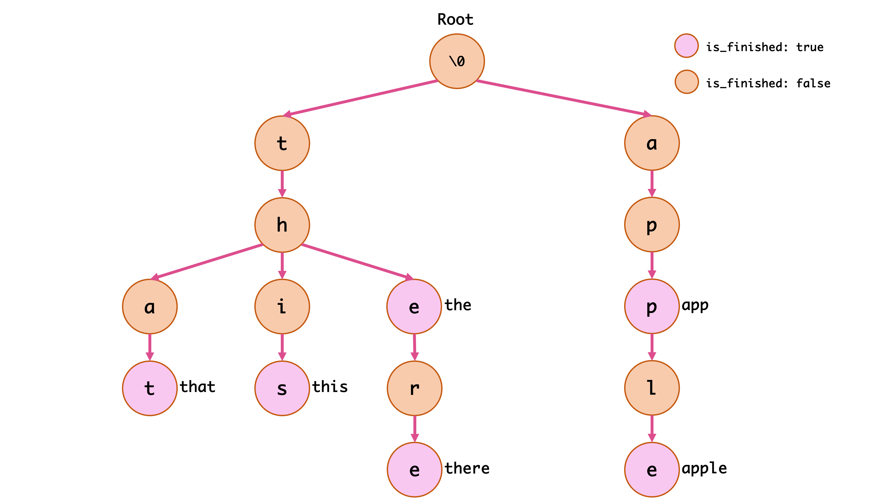

<h1 align="center">
<strong>AUT_BP_2024_Fall Homework 6</strong>
</h1>

<p align="center">
<strong> Deadline: 19th of Dey - Wednesday - 23:59 o'clock</strong>
</p>

---

# Question 1: Trie Data structure

In this Question, you will implement a **Trie** data structure using **C programming language**. The goal is to practice working with **structs**, **dynamic memory allocation**, and **file operations**. This question covers creating the data structure, implementing fundamental operations, and adding functionality to save and load the data structure from a file.

---

## What is a Trie?

A **Trie**, also known as a **Prefix Tree**, is a special type of search tree used to store strings efficiently. It is widely used for applications like **autocomplete**, **spell checking**, and **dictionary implementations**.

### Why Use a Trie?

1. **Efficient Search**: Searching for words in a trie is faster than linear search, especially for prefix-based queries.
2. **Memory Optimization**: It avoids storing duplicate prefixes, saving space.
3. **Applications**: Useful in building **autocomplete systems**, **IP routing tables**, and **data compression algorithms**.

### How Does a Trie Work?

-   Each node represents a **single character**.
-   Each path from the root to a leaf node represents a **word**.
-   Child nodes are dynamically allocated as needed.
-   Words are marked by a **flag** at the end of each word.

Example Trie:

<p align="center">
  
</p>

---

## Requirements

1. Design the **struct** for the trie.
2. Implement common functions to operate on the trie.
3. Add functions to **save** the trie to a file and **load** it back.

---

## Task 1: Define the Struct

```c
// Trie Node Definition
typedef struct TrieNode {
    struct TrieNode* children[26]; // Pointers for 26 lowercase English letters
    int isEndOfWord;               // Flag to mark end of a word
} TrieNode;

// Trie Definition
typedef struct Trie {
    TrieNode* root;               // Pointer to the root node
} Trie;
```

### Explanation:

-   **`children`**: An array of pointers to child nodes, representing the 26 lowercase letters.
-   **`isEndOfWord`**: A flag (0 or 1) that indicates whether the node marks the end of a word.
-   **Dynamic Memory Allocation**: All nodes must be allocated on the **heap** using `malloc()`.

---

## Task 2: Function Prototypes

You must implement the following functions:

### 1. `Trie* createTrie();`

-   **Purpose**: Initializes and returns a new empty trie.
-   **Input**: None.
-   **Output**: A pointer to the created Trie.

### 2. `void insertWord(Trie* trie, const char* word);`

-   **Purpose**: Inserts a word into the trie.
-   **Input**: The trie pointer and the word to insert.
-   **Output**: None.

### 3. `bool searchWord(Trie* trie, const char* word);`

-   **Purpose**: Searches for a word in the trie.
-   **Input**: The trie pointer and the word to search.
-   **Output**: Returns `true` if the word exists, `false` otherwise.

### 4. `void deleteWord(Trie* trie, const char* word);`

-   **Purpose**: Deletes a word from the trie.
-   **Input**: The trie pointer and the word to delete.
-   **Output**: None.
-   **Note**: If a node has no children, free its memory. Additionally, free the memory of its parent nodes if they do not mark the end of another word. For example, in the provided trie image, deleting the word `apple` requires freeing the memory for the nodes `e` and `l`, as they are no longer needed. However, do not free the memory for the node `p` because it is still needed for the word `app`.

### 5. `void saveTrie(Trie* trie, const char* filename);`

-   **Purpose**: Saves the entire trie to a file.
-   **Input**: The trie pointer and the filename.
-   **Output**: None.
-   **Note**: You have the flexibility to implement this function in any manner you prefer. We provide you with the `trie` and the `filename`, and you can write to this file in any format you choose. The only requirement is that the file must be structured in such a way that it can be loaded exactly as it was in the loadTrie function later. You can use either binary or text format, as per your preference.

### 6. `Trie* loadTrie(const char* filename);`

-   **Purpose**: Loads a trie from a file. We will use the file that you have saved using your own code. you have to create the exact same Trie that you have saved previously.
-   **Input**: The filename.
-   **Output**: A pointer to the loaded trie.

### 7. `void freeTrie(Trie* trie);`

-   **Purpose**: Frees all dynamically allocated memory associated with the trie.
-   **Input**: The trie pointer.
-   **Output**: None.

---

## Notes for Implementation

1. **Dynamic Memory Allocation**: Use `malloc()` to create nodes and `free()` to deallocate memory.
2. **File Format**: You can choose any file format for saving and loading the trie, but ensure the data is saved and loaded correctly.
3. **Edge Cases**:
    - Support only lowercase letters. if there is any uppercase letters in input, make them lowercase, our Trie only store lowercase letters.
    - Manage attempts to insert or delete words that already exist or don’t exist.

---

# Question 2: Macros for Debugging

## **Introduction to Macros**

In C programming, macros are preprocessor directives that allow code expansion before compilation. They can be used to simplify repetitive tasks, improve code readability, and create conditional behaviors. One common use case for macros is **debugging**.

In this assignment, you will implement a **debug_log macro** that provides detailed debugging information, including the **file name**, **line number**, **message**, and **error significance**. Additionally, it will use a **condition** to determine whether the log should be displayed, allowing us to check for runtime errors or inconsistencies effectively.

---

## **Problem Statement**

Your task is to implement a macro named **`DEBUG_LOG`** that:

1. Logs debug information if a specified **condition** is **false**.
2. Logs the following details:
    - **File Name** – The name of the source file where the error occurred.
    - **Line Number** – The exact line number where the macro was invoked.
    - **Message** – A custom error message provided by the programmer.
    - **Error Significance** – An additional label indicating the severity of the error (e.g., **INFO**, **WARNING**, **ERROR**).
    - **Failed Condition** - Also show the condition that has failed.
3. Allows enabling or disabling debug logs via a **compile-time switch** (`DEBUG_MODE`).
4. Your `Macro MUST NOT abort` the program, just show the message in the console.

---

## **Functionality Requirements**

You will define the following macro in your code:

```c
#define DEBUG_LOG(condition, significance, msg)
```

### **Behavior**

-   If **`DEBUG_MODE`** is enabled and the **condition** evaluates to **false**, the macro should:

    -   Print the file name and line number using `__FILE__` and `__LINE__`.
    -   Print the significance level (INFO, WARNING, ERROR).
    -   Print the provided message.
    -   Print the Failed condition.

-   If **`DEBUG_MODE`** is disabled, the macro should not produce any output.

---

## **Examples**

### Example 1: Basic Usage

```c
#define DEBUG_MODE
DEBUG_LOG(x > 0, "ERROR", "x should be positive"); // For example, this line is in util.c, line 20
```

**Output (if `x <= 0`):**

```
[ERROR] File: util.c, Line: 20 - x should be positive, Failed Condition: x > 0
```

### Example 2: Compile-Time Control

```c
#define DEBUG_MODE
DEBUG_LOG(arr != NULL, "WARNING", "Array is NULL."); // For example, this line is in main.c, line 23
```

**Output (if `arr == NULL`):**

```
[WARNING] File: main.c, Line: 23 - Array pointer is NULL, Failed Condition: arr != NULL
```

### Example 3: Disabled Debug Logs

```c
#undef DEBUG_MODE
DEBUG_LOG(1 == 0, "ERROR", "This should never happen.");
```

**Output:**

```
(No output because DEBUG_MODE is disabled.)
```

---

If you have any questions regarding the homework, feel free to reach out:

-   **Teaching Assistant**: Seyyed Mohammad Hamidi
-   **Telegram Group**: [t.me/AUT_BP_Fall_2024](https://t.me/AUT_BP_Fall_2024)
-   **Github**: [github.com/smhamidi](https://github.com/smhamidi)

---

<p align="center">
  
</p>

**Best Regards, [Hamidi](https://github.com/smhamidi)**
